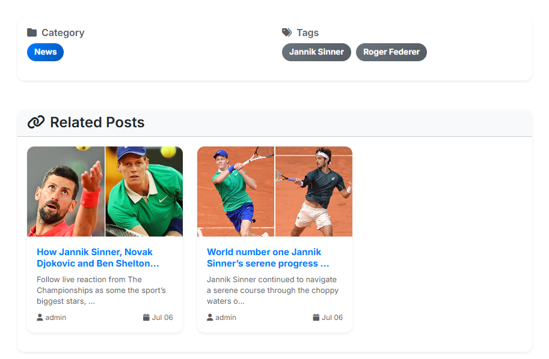
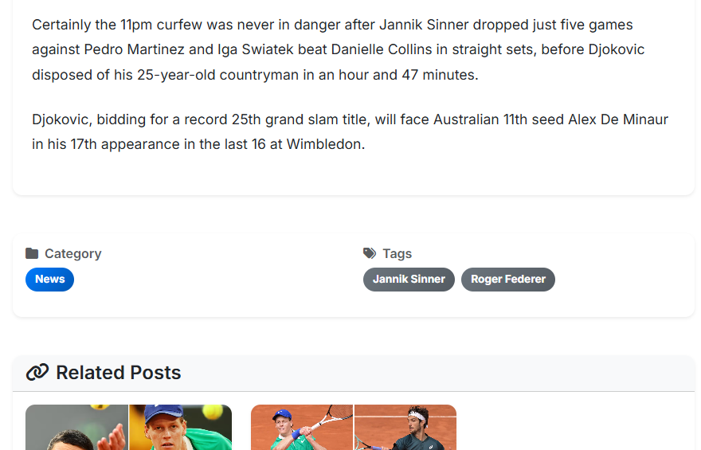
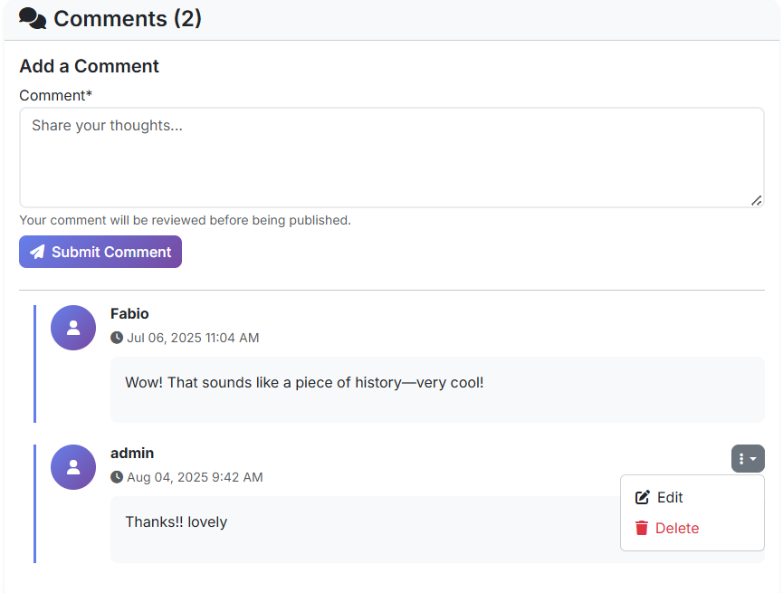
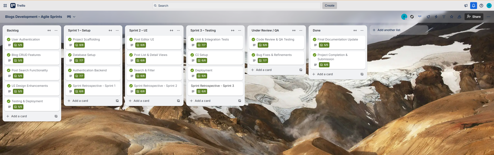
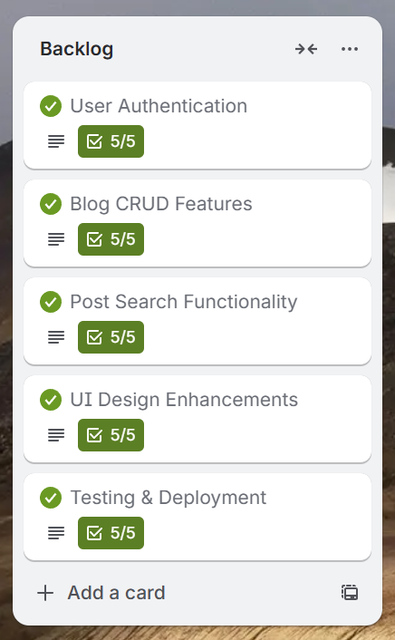
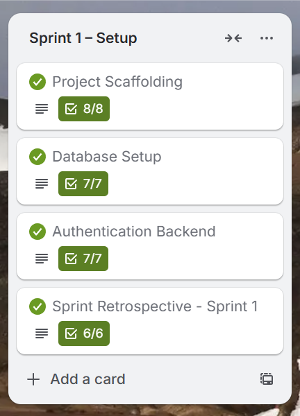
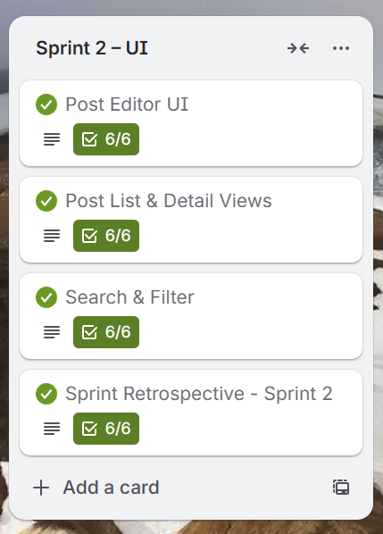
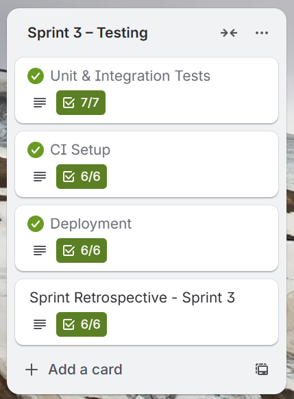
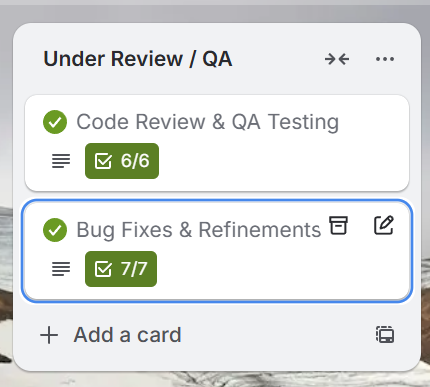
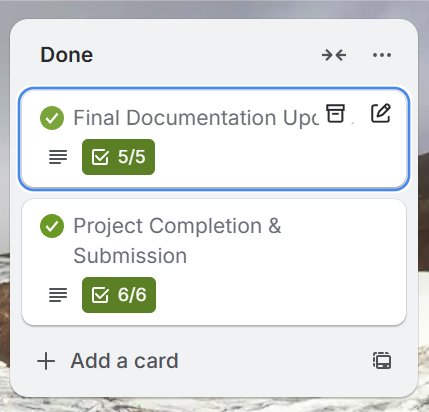

# The Tennis Time – A Full-Stack Django Blog

[](https://www.djangoproject.com/)
[](https://www.python.org/)
[](https://getbootstrap.com/)
[](LICENSE)
[](https://blog-djanago-2acbfce559e4.herokuapp.com)

**The Tennis Time** is a full-stack editorial blog developed with **Django**, tailored for tennis enthusiasts. The platform delivers compelling content like match commentary, club news, and editorial insights through a responsive frontend and a powerful Django admin backend. Editors can manage articles, images, tags, and comments from a secure, modular admin interface.


---

## Table of Contents

1. [Live Demo](#live-demo)  
2. [Project Overview](#project-overview)  
   - [Key Capabilities](#key-capabilities)  
   - [Key Features](#key-features)  
   - [Design System](#design-system)  
     - [Color Palette](#color-palette)  
     - [Typography Hierarchy](#typography-hierarchy)  
     - [Responsive Layout](#responsive-layout)  
3. [User Experience & User Stories](#user-experience--user-stories)  
   - [Guest User](#guest-user)  
   - [Registered User](#registered-user)  
   - [Administrator](#administrator)  
4. [Project Structure & Interface Overview](#project-structure--interface-overview)  
   - [Frontend Pages](#frontend-pages)  
     - [Homepage](#homepage)  
     - [About Page](#about-page)  
     - [Category Pages](#category-pages)  
     - [Tag Pages](#tag-pages)
     - [Tag-Based Navigation](#tag-based-navigation)
     - [Front-End Comment Management](#front-end-comment-management)
     - [Related Posts](#related-posts)  
   - [Admin Panel Modules](#admin-panel-modules)  
     - [Main Admin Interface](#main-admin-interface)  
     - [Tags Module](#tags-module)  
     - [Posts Module](#posts-module)  
     - [Users Module](#users-module)  
     - [Categories Module](#categories-module)  
     - [Comments Module](#comments-module)  
5. [Technology Stack](#technology-stack)  
   - [Architecture Overview](#architecture-overview)  
   - [Key Dependencies](#key-dependencies)  
6. [Example Editorial Workflow](#example-editorial-workflow)  
7. [Configuration](#configuration)  
   - [Django Settings](#django-settings)  
   - [AllAuth Configuration](#allauth-configuration)  
   - [Summernote Configuration](#summernote-configuration)  
8. [Quick Start Guide](#quick-start-guide)  
   - [Prerequisites](#prerequisites)  
   - [Installation Steps](#installation-steps)  
   - [Next Steps](#next-steps)  
9. [Deployment on Heroku](#deployment-on-heroku)  
   - [Heroku Setup](#1-heroku-setup)  
   - [Environment Variables](#2-environment-variables)  
   - [Deploy](#3-deploy)  
   - [Open Application](#4-open-application)  
10. [Testing](#testing)  
    - [Frontend Testing Table](#frontend-testing-table)  
    - [Admin Panel (Backend) Testing Table](#admin-panel-backend-testing-table)  
11. [Agile Methodology & Workflow](#agile-methodology-&-workflow)  
12. [Acknowledgments](#acknowledgments)

---

## Live Demo

**[View Live Application](https://blog-djanago-2acbfce559e4.herokuapp.com)**

Experience the full functionality of The Tennis Time blog with real content and interactive features.

---

## Project Overview

The Tennis Time offers structured editorial coverage of global and local tennis with a content-first approach. Built with modern web technologies, it provides a comprehensive platform for tennis journalism and community engagement.

### Key Capabilities
- **Display related posts** on each post page to encourage further reading  
- **Tag-based navigation** to easily explore similar articles  
- **Front-end comment management** – users can create, edit, and delete comments directly from the post page  
- **Dynamic content filtering** by category and tag  
- **Admin-controlled publishing system** with a WYSIWYG editor  
- **User authentication and comment moderation** powered by Django Allauth  
- **SEO-optimized** content structure and URLs  
- **Mobile-first, responsive design** for optimal viewing across all devices  

### Key Features

| Feature | Description |
|---------|-------------|
| **Responsive Design** | Fully usable on any device, from desktops to tablets and smartphones |
| **Django Admin Panel** | Secure and modular admin interface for managing articles, images, tags, and comments |
| **Dynamic Content Filtering** | Users can explore content by **category** and **tag** |
| **Related Posts** | Each article page includes suggestions for related posts to enhance content discovery |
| **Rich-Text Editor** | **WYSIWYG** editor powered by Django Summernote for easy content creation |
| **User Authentication** | Secure authentication and comment moderation via **Django Allauth** |
| **Custom Design System** | Tennis-themed color scheme and typography for brand consistency |
| **SEO Optimization** | Built-in SEO features for better search engine visibility |

### Design System

#### Color Palette
| Element | Color | Hex Code | Usage |
|---------|-------|----------|-------|
| **Primary Background** | White | `#FFFFFF` | Clean, professional backdrop |
| **Headings** | Black | `#000000` | Strong visual hierarchy |
| **Body Text** | Gray | `#6C757D` | Readable content |
| **Primary Actions** | Grass Green | `#28A745` | Buttons and links |
| **Highlights** | Clay Red | `#DC3545` | Alerts and emphasis |
| **Navigation** | Dark Green | `#1E7E34` | Main navigation bar |

#### Typography Hierarchy
| Element | Size | Weight | Color | Purpose |
|---------|------|--------|-------|---------|
| **H1** | 2.5rem | Bold | `#1E7E34` | Main page titles |
| **H2** | 2rem | Semi-bold | `#000000` | Section headers |
| **H3** | 1.5rem | Medium | `#495057` | Subsection headers |
| **Body** | 1rem | Regular | `#000000` | Main content |
| **Metadata** | 0.875rem | Light | `#6C757D` | Post info |
| **Tags** | 0.75rem | Bold | Accent colors | Category labels |

#### Responsive Layout
- **Mobile-First Design**: Optimized for smartphones with progressive enhancement
- **Breakpoints**: 576px, 768px, 992px, 1200px for seamless scaling
- **Grid System**: Bootstrap-based responsive grid
  - **Desktop**: 3-column article layout
  - **Tablet**: 2-column optimized view
  - **Mobile**: Single-column full-width cards
- **Navigation**: Sticky navbar with tennis ball logo and hamburger menu
- **Components**: Card-based design with hover effects and breadcrumb navigation

---

## User Experience & User Stories

The Tennis Time is designed with three distinct user personas to ensure an optimal experience for everyone in the tennis community.

### Guest User
**Goal**: Discover and consume tennis content without barriers

| User Story | Acceptance Criteria |
|------------|-------------------|
| **As a Guest**, I can read all blog articles without needing to log in | ✅ No registration required for content access |
| **As a Guest**, I want to access the site on any device | ✅ Fully responsive design across all screen sizes |
| **As a Guest**, I want to navigate content using categories and tags | ✅ Intuitive filtering and search functionality |
| **As a Guest**, I want to discover related articles | ✅ Related posts suggestions on every article page |

### Registered User
**Goal**: Engage with the community through comments and personalized features

| User Story | Acceptance Criteria |
|------------|-------------------|
| **As a Registered User**, I want to securely log in and out | ✅ Django Allauth authentication system |
| **As a Registered User**, I can comment on posts | ✅ Comment system with moderation capabilities |
| **As a Registered User**, I want to receive notifications | ✅ Email notifications for comment replies |

### Administrator
**Goal**: Manage content, users, and community engagement effectively

| User Story | Acceptance Criteria |
|------------|-------------------|
| **As an Administrator**, I want full access to the Django Admin Panel | ✅ Comprehensive admin interface with all modules |
| **As an Administrator**, I can create, edit, and delete posts, categories, and tags | ✅ Complete CRUD operations for all content types |
| **As an Administrator**, I need to moderate user comments | ✅ Comment moderation tools with approval workflow |
| **As an Administrator**, I can manage users and their permissions | ✅ User management with role-based access control |

---

## Project Structure & Interface Overview

### Frontend Pages

#### Homepage
The homepage, also called "Latest Posts", displays the most recent articles in a grid-based layout. Each post preview includes a title, a featured image, and an excerpt. The layout is responsive and mobile-first.


#### About Page
This page introduces the blog with a compelling narrative from the creator, Fabio, which emphasizes the community-driven purpose behind the blog. The page outlines three key editorial categories using a clean, card-based layout: **Rally & Banter**, **Local Focus**, and **Beyond the Baseline**.


#### Category Pages
These pages are accessed via the URL `/category/<category_name>` and filter posts by a specific editorial section. They display responsive article cards and may also show the article count for that category.


#### Tag Pages
Similar to category pages, these pages are found at `/tag/<tag_name>` and filter posts by a specific player or topic, such as "Jannik Sinner". Each tag links to a filtered content page to help users find related content.


#### Related Posts  
Each post page includes a section that **displays related articles** based on shared tags or categories. This feature encourages deeper engagement by guiding readers to similar content.  




#### Tag-Based Navigation  
Every article includes **clickable tags** that allow users to explore other posts with the same tag. This improves site navigation and helps users discover content relevant to their interests.  




#### Front-End Comment Management  
Users can **create, edit, and delete comments directly on the post page**. The interface is intuitive and provides a seamless interaction without needing to access the admin panel.  



---

### Admin Panel Modules

#### Main Admin Interface
The admin panel is built on Django's native interface, giving editors and content managers a secure and streamlined environment. It features a left-hand sidebar for categorized modules and a real-time "Recent Actions" feed to track editorial activities.


#### Tags Module
- Manages keywords for organizing and filtering posts  
- Enables tag-based URLs for improved discoverability and SEO  
- Supports dynamic content linking and filtering  

#### Posts Module 
- Core tool for writing and publishing blog content  
- Supports rich media, tags, and categories  
- Powers homepage excerpts and post previews  

#### Users Module
- Handles user accounts, roles, and permissions  
- Part of Django's built-in authentication system  

#### Categories Module 
- Organizes content into thematic sections  
- Enables structured navigation and filtering  
- Supports SEO-friendly URLs for category views  

#### Comments Module  
- Central interface for managing user comments  
- Allows reviewing, editing, approving, or deleting comments  
- Shows comment author, content preview, and linked post 

---

## Technology Stack

The Tennis Time is built using a modern, scalable technology stack designed for performance and maintainability.

### Architecture Overview
| Layer | Technology | Version | Purpose |
|-------|------------|---------|---------|
| **Backend Framework** | Django | 4.2+ | Robust web framework with built-in admin |
| **Programming Language** | Python | 3.8+ | Clean, readable code with extensive libraries |
| **Frontend Framework** | Bootstrap | 5.0+ | Responsive design and UI components |
| **Database** | SQLite/PostgreSQL | - | Development/Production database |
| **Templating Engine** | Django Templates | - | Server-side rendering |
| **Rich Text Editor** | Django Summernote | - | WYSIWYG content creation |
| **Authentication** | Django Allauth | - | User management and social login |
| **Deployment** | Heroku | - | Cloud hosting platform |
| **Version Control** | Git & GitHub | - | Code management and collaboration |

### Key Dependencies
- **Django 4.2+**: Core web framework
- **Bootstrap 5.0+**: Frontend styling and components
- **Django Summernote**: Rich text editing
- **Django Allauth**: Authentication system
- **Pillow**: Image processing
- **Whitenoise**: Static file serving

---

## Example Editorial Workflow

This is a step-by-step guide for an editor or administrator to publish a new post using the Django admin panel.

1. Log in at `/admin/`.
2. Navigate to **Posts** and click **Add**.
3. Fill in the necessary fields:
   - **Title** of the post.
   - Upload a featured image.
   - Write content using the **WYSIWYG editor**.
   - Select a **category** (e.g., "News").
   - Add **tags** (e.g., "Djokovic").
   - Choose publish/draft status.
4. Monitor the **Recent Actions** feed and moderate any new **Comments** as they come in.

---

## Configuration

### Django Settings
- `DEBUG`: Set to `False` in production for security.
- `ALLOWED_HOSTS`: Must be configured for your domain.
- `DATABASE_URL`: Automatically configured by Heroku when using the Postgres add-on.
- `STATIC_ROOT`: Set to `staticfiles` for production deployment.

### AllAuth Configuration
- Uses email-based authentication with no username required.
- Email verification is disabled but can be easily enabled.
- Custom URLs for login/logout redirects are defined.

### Summernote Configuration
- A rich text editor for post content, allowing for custom toolbar configurations.
- Includes image upload support and fullscreen modes for a better editing experience.

---

## Quick Start Guide

Get The Tennis Time running on your local machine in just a few steps.

### Prerequisites
- Python 3.8 or higher
- Git
- Virtual environment tool (venv)

### Installation Steps

1. **Clone the repository**
   ```bash
   git clone https://github.com/fabioeloche/blogs.git
   cd blogs
   ```

2. **Create and activate virtual environment**
   ```bash
   # Create virtual environment
   python -m venv venv
   
   # Activate (choose your OS)
   # Windows
   .\venv\Scripts\activate
   # macOS/Linux
   source venv/bin/activate
   ```

3. **Install dependencies**
   ```bash
   pip install -r requirements.txt
   ```

4. **Set up the database**
   ```bash
   python manage.py migrate
   ```

5. **Create admin user**
   ```bash
   python manage.py createsuperuser
   ```

6. **Run the development server**
   ```bash
   python manage.py runserver
   ```

### Next Steps
- Add sample content through the admin panel
- Customize the design in `static/css/style.css`
- Configure email settings for user registration

---

## Deployment on Heroku

### 1. Heroku Setup
First, install the Heroku CLI and log in. Then, create a new app and add the PostgreSQL addon.
```bash
heroku create your-app-name
heroku addons:create heroku-postgresql:mini
```

### 2. Environment Variables
Set the necessary environment variables for your deployed application.
```bash
heroku config:set SECRET_KEY=your-production-secret-key
heroku config:set DEBUG=False
heroku config:set CLOUDINARY_URL=your-cloudinary-url
```

### 3. Deploy
Add all files, commit them, and push the project to Heroku. Then, run migrations and collect static files for production.
```bash
git add .
git commit -m "Initial deployment"
git push heroku main
heroku run python manage.py migrate
heroku run python manage.py createsuperuser
heroku run python manage.py collectstatic --noinput
```

### 4. Open Application
Once deployed, you can open your application in the browser using the following command:
```bash
heroku open
```

---

## Testing

### Comprehensive Testing Table – Frontend & Admin Modules

#### Frontend Testing Table

| Module / Feature         | Expected Outcome                                                                 | Testing Action                          | Result                                  | Pass/Fail |
|--------------------------|----------------------------------------------------------------------------------|-----------------------------------------|-----------------------------------------|-----------|
| Homepage Load            | Loads featured posts with title, image, excerpt, and "Read More" button           | Visit /                                 | Content renders as expected             | ✅ Pass   |
| Category Filtering       | Filters posts by category                                                        | Click on a category link                | Only relevant category posts shown      | ✅ Pass   |
| Tag Filtering            | Filters posts by tag                                                             | Click on a tag link                     | Only relevant tagged posts shown        | ✅ Pass   |
| Post Detail View         | Loads full post with all elements (text, image, comments, etc.)                  | Click "Read More"                       | Full article loads with media           | ✅ Pass   |
| About Page               | Displays narrative and editorial categories                                      | Visit /about                            | Text, categories, and visuals load correctly | ✅ Pass   |
| Responsive Layout        | Adapts to all screen sizes                                                       | Resize browser, test on devices         | Fully responsive across viewports       | ✅ Pass   |
| Browser Compatibility    | Works on Chrome, Firefox, Safari, Edge                                           | Open site in major browsers             | No display or functionality issues      | ✅ Pass   |

#### Admin Panel (Backend) Testing Table

| Admin Module             | Expected Outcome                                                                 | Testing Action                          | Result                                  | Pass/Fail |
|--------------------------|----------------------------------------------------------------------------------|-----------------------------------------|-----------------------------------------|-----------|
| Login Page               | Authenticates via Allauth                                                       | Visit /admin/, enter credentials        | Login successful                        | ✅ Pass   |
| Posts                    | Add/edit blog posts with categories, tags, and images                            | Admin → Posts → Add                     | Posts created and published correctly   | ✅ Pass   |
| Categories               | Create or update editorial sections                                              | Admin → Categories                      | Changes reflect on frontend filter pages| ✅ Pass   |
| Tags                     | Add labels to posts                                                              | Admin → Tags                            | Tags save and appear on frontend        | ✅ Pass   |
| Comments                 | Approve/delete user comments                                                     | Admin → Comments                        | Comments moderate successfully          | ✅ Pass   |
| Attachments              | Upload reusable media via Summernote editor                                      | Admin → Attachments                     | Media uploads successfully, reusable in posts | ✅ Pass   |
| About Page               | Edit WYSIWYG content for About section                                           | Admin → About                           | Saved content displays on /about/       | ✅ Pass   |
| Email Addresses          | Manage user email addresses and status                                           | Admin → Email Addresses                 | Changes applied properly                | ✅ Pass   |
| Users                    | Create users, assign roles                                                       | Admin → Users                           | User accounts function correctly        | ✅ Pass   |
| Groups                   | Define roles and permission sets                                                | Admin → Groups                          | Roles applied with correct permissions  | ✅ Pass   |
| Sites                    | Configure domain settings                                                       | Admin → Sites                           | Sites configured without error          | ✅ Pass   |
| Social Accounts          | View users' linked social logins                                                 | Admin → Social Accounts                 | Social logins listed correctly          | ✅ Pass   |
| Social Tokens            | View OAuth2 access and refresh tokens                                            | Admin → Social Application Tokens       | Tokens stored and displayed securely    | ✅ Pass   |
| Social Applications      | Integrate third-party providers (Google, GitHub, etc.)                           | Admin → Social Applications             | Providers configured and site assignment works | ✅ Pass   |

---

## Agile Methodology & Workflow

This project was developed following Agile methodology with a Scrum-inspired sprint structure. The workflow was managed using Trello as an Agile tool, ensuring consistent sprint planning, progress tracking, and retrospectives.

### Tools Used
- **Trello** – Task management, sprint tracking, retrospectives.
- **GitHub Issues & Commits** – Tracking bugs, linking commits, and ensuring iterative delivery.
- **GitHub Projects** (optional) – Milestone and backlog visualization.

### Trello Board Overview



The Trello board titled "Blogs Development – Agile Sprints" visualizes the entire workflow, from planning to deployment. Lists on the board represent each sprint and its stage:

| List Name | Description |
|-----------|-------------|
| **Backlog** | Product backlog with user stories, features, and enhancements planned for development. |
| **Sprint 1 – Setup** | Environment setup, database configuration, and core authentication. |
| **Sprint 2 – UI** | UI/UX design improvements and CRUD feature enhancement. |
| **Sprint 3 – Testing** | Testing, CI setup, deployment, and documentation finalization. |
| **Under Review / QA** | Work completed and pending review/testing. |
| **Done** | Fully verified and accepted tasks. |

Screenshots of the Trello board showing the completed sprints can be found in the `/media/readme_images/` folder. Each card includes detailed user stories, acceptance criteria, and checklists.

### Sprint Breakdown

#### Backlog (Planning Phase)



This list captured all core features and user stories before sprint allocation.

| Card | Description |
|------|-------------|
| **User Authentication** | Implement secure login/logout using Flask-Login or JWT. |
| **Blog CRUD Features** | Enable creating, editing, and deleting blog posts. |
| **Post Search Functionality** | Add keyword search and filtering for blog posts. |
| **UI Design Enhancements** | Improve overall site design and responsiveness. |
| **Testing & Deployment** | Plan for automated testing and cloud deployment. |

All backlog cards contained user stories, acceptance criteria, and task checklists, providing full visibility of scope before sprint distribution.

#### Sprint 1 – Setup & Core Features



**Goal:** Establish the development environment, configure the database, and implement user authentication.

| Card | Outcome |
|------|---------|
| **Project Scaffolding** | Repo initialized with Flask app, folder structure, and README. |
| **Database Setup** | Configured with migrations and test data. |
| **Authentication Backend** | Login/logout routes and session handling implemented. |

**Sprint Retrospective – Sprint 1**  
Reflected on setup speed, testing delays, and improved planning for Sprint 2.

**Deliverables:** Running Flask app, database connection, working login/logout, README setup guide.

#### Sprint 2 – UI & Content Management



**Goal:** Enhance UI/UX and implement CRUD and search functionality for blog content.

| Card | Outcome |
|------|---------|
| **Post Editor UI** | Created and edit post forms with validation. |
| **Post List & Detail Views** | Added responsive list/detail pages for posts. |
| **Search & Filter** | Enabled keyword search and author/date filtering. |

**Sprint Retrospective – Sprint 2**  
Focused on improving code review speed and time estimation for Sprint 3.

**Deliverables:** Complete CRUD functionality, user-friendly interface, and improved navigation.

#### Sprint 3 – Testing, CI & Deployment



**Goal:** Test all features, integrate CI/CD, and deploy the final app to production.

| Card | Outcome |
|------|---------|
| **Unit & Integration Tests** | Automated tests covering key routes and models. |
| **CI Setup** | GitHub Actions pipeline added for automated testing. |
| **Deployment** | Successfully deployed to Heroku with environment configuration. |

**Sprint Retrospective – Sprint 3**  
Project finalized, documentation updated, lessons learned recorded.

**Deliverables:** Fully tested, deployed, and documented Flask blog application.

### Quality Assurance & Review Process



The "Under Review / QA" list ensured all completed work underwent thorough testing before being marked as done. This process included:

- Code review and testing
- Feature validation against acceptance criteria
- Cross-browser compatibility testing
- Performance optimization verification

### Completed Work



The "Done" list represents all successfully completed and verified tasks, demonstrating the iterative delivery of working software throughout the development process.

### Agile Principles Applied

- **Iterative Development:** Features delivered in working increments
- **Continuous Feedback:** Regular retrospectives and process improvement
- **Collaborative Planning:** Sprint planning with clear user stories
- **Transparent Progress:** Visual workflow with Trello board
- **Quality Focus:** Dedicated QA phase for each deliverable


---

## Acknowledgments

- **Django Community**: For the excellent web framework
- **Bootstrap Team**: For the responsive design framework
- **Tennis Community**: For inspiration and feedback

---

**Made with ❤️ for the tennis community**