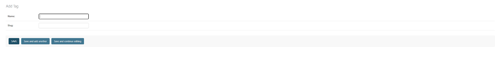
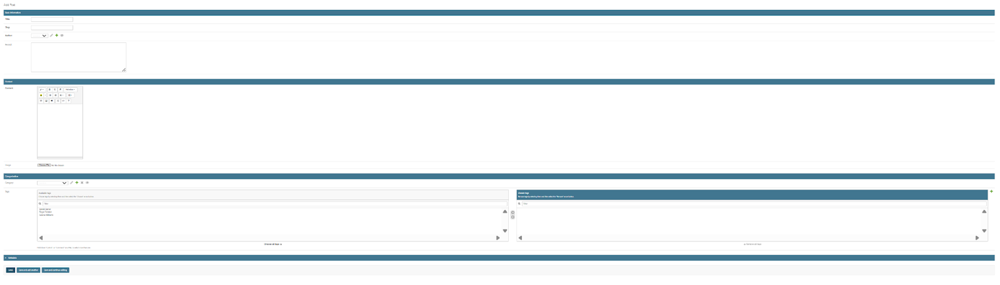
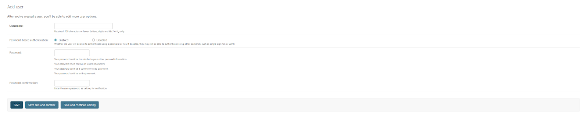
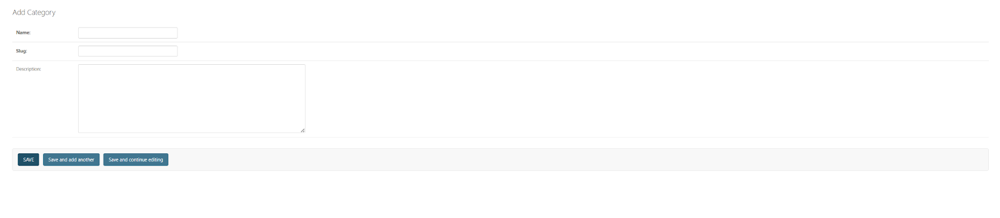
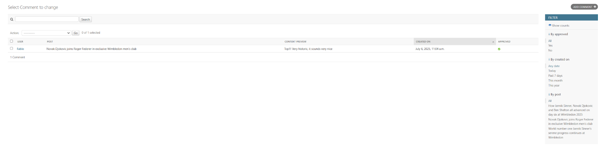

# 🎾 The Tennis Time – A Full-Stack Django Blog

[](https://www.djangoproject.com/)
[](https://www.python.org/)
[](https://getbootstrap.com/)
[](LICENSE)
[](https://blog-djanago-2acbfce559e4.herokuapp.com)

**The Tennis Time** is a full-stack editorial blog developed with **Django**, tailored for tennis enthusiasts. The platform delivers compelling content like match commentary, club news, and editorial insights through a responsive frontend and a powerful Django admin backend. Editors can manage articles, images, tags, and comments from a secure, modular admin interface.

## Live Demo

**[🌐 View Live Application](https://blog-djanago-2acbfce559e4.herokuapp.com)**

Experience the full functionality of The Tennis Time blog with real content and interactive features.

---

## Project Overview

The Tennis Time offers structured editorial coverage of global and local tennis with a content-first approach. Built with modern web technologies, it provides a comprehensive platform for tennis journalism and community engagement.

### Core Mission
- **Content-First Approach**: Prioritize quality tennis journalism and community stories
- **User Experience**: Intuitive navigation and responsive design for all devices
- **Editorial Workflow**: Streamlined content management for writers and editors
- **Community Engagement**: Interactive features to foster tennis community discussions

### Key Capabilities
- **Dynamic content filtering** by category and tag
- **Admin-driven publishing system** with WYSIWYG editor
- **User authentication and comment moderation** via Django Allauth
- **SEO-optimized** content structure and URLs
- **Mobile-first responsive design** for optimal viewing on all devices

### Key Features

| Feature | Description |
|---------|-------------|
| **Responsive Design** | Fully usable on any device, from desktops to tablets and smartphones |
| **Django Admin Panel** | Secure and modular admin interface for managing articles, images, tags, and comments |
| **Dynamic Content Filtering** | Users can explore content by **category** and **tag** |
| **Related Posts** | Each article page includes suggestions for related posts to enhance content discovery |
| **Rich-Text Editor** | **WYSIWYG** editor powered by Django Summernote for easy content creation |
| **User Authentication** | Secure authentication and comment moderation via **Django Allauth** |
| **Custom Design System** | Tennis-themed color scheme and typography for brand consistency |
| **SEO Optimization** | Built-in SEO features for better search engine visibility |

### Design System

#### Color Palette
| Element | Color | Hex Code | Usage |
|---------|-------|----------|-------|
| **Primary Background** | White | `#FFFFFF` | Clean, professional backdrop |
| **Headings** | Black | `#000000` | Strong visual hierarchy |
| **Body Text** | Gray | `#6C757D` | Readable content |
| **Primary Actions** | Grass Green | `#28A745` | Buttons and links |
| **Highlights** | Clay Red | `#DC3545` | Alerts and emphasis |
| **Navigation** | Dark Green | `#1E7E34` | Main navigation bar |

#### 📝 Typography Hierarchy
| Element | Size | Weight | Color | Purpose |
|---------|------|--------|-------|---------|
| **H1** | 2.5rem | Bold | `#1E7E34` | Main page titles |
| **H2** | 2rem | Semi-bold | `#000000` | Section headers |
| **H3** | 1.5rem | Medium | `#495057` | Subsection headers |
| **Body** | 1rem | Regular | `#000000` | Main content |
| **Metadata** | 0.875rem | Light | `#6C757D` | Post info |
| **Tags** | 0.75rem | Bold | Accent colors | Category labels |

#### Responsive Layout
- **Mobile-First Design**: Optimized for smartphones with progressive enhancement
- **Breakpoints**: 576px, 768px, 992px, 1200px for seamless scaling
- **Grid System**: Bootstrap-based responsive grid
  - **Desktop**: 3-column article layout
  - **Tablet**: 2-column optimized view
  - **Mobile**: Single-column full-width cards
- **Navigation**: Sticky navbar with tennis ball logo and hamburger menu
- **Components**: Card-based design with hover effects and breadcrumb navigation

---

## 👥 User Experience & User Stories

The Tennis Time is designed with three distinct user personas to ensure an optimal experience for everyone in the tennis community.

### 🎾 Guest User
**Goal**: Discover and consume tennis content without barriers

| User Story | Acceptance Criteria |
|------------|-------------------|
| **As a Guest**, I can read all blog articles without needing to log in | ✅ No registration required for content access |
| **As a Guest**, I want to access the site on any device | ✅ Fully responsive design across all screen sizes |
| **As a Guest**, I want to navigate content using categories and tags | ✅ Intuitive filtering and search functionality |
| **As a Guest**, I want to discover related articles | ✅ Related posts suggestions on every article page |

### 🔐 Registered User
**Goal**: Engage with the community through comments and personalized features

| User Story | Acceptance Criteria |
|------------|-------------------|
| **As a Registered User**, I want to securely log in and out | ✅ Django Allauth authentication system |
| **As a Registered User**, I can comment on posts | ✅ Comment system with moderation capabilities |
| **As a Registered User**, I want to receive notifications | ✅ Email notifications for comment replies |

###  Administrator
**Goal**: Manage content, users, and community engagement effectively

| User Story | Acceptance Criteria |
|------------|-------------------|
| **As an Administrator**, I want full access to the Django Admin Panel | ✅ Comprehensive admin interface with all modules |
| **As an Administrator**, I can create, edit, and delete posts, categories, and tags | ✅ Complete CRUD operations for all content types |
| **As an Administrator**, I need to moderate user comments | ✅ Comment moderation tools with approval workflow |
| **As an Administrator**, I can manage users and their permissions | ✅ User management with role-based access control |

---

## 📸 Screenshots & Interface Overview

> **Note**: All screenshots are stored in the `media/readme_images/` folder and showcase the complete user experience of The Tennis Time blog.

### Homepage
The homepage, also called "Latest Posts", displays the most recent articles in a grid-based layout. Each post preview includes a title, a featured image, and an excerpt. The layout is responsive and mobile-first.


### About Page
This page introduces the blog with a compelling narrative from the creator, Fabio, which emphasizes the community-driven purpose behind the blog. The page outlines three key editorial categories using a clean, card-based layout: **Rally & Banter**, **Local Focus**, and **Beyond the Baseline**.


### Category Pages
These pages are accessed via the URL `/category/<category_name>` and filter posts by a specific editorial section. They display responsive article cards and may also show the article count for that category.


### Tag Pages
Similar to category pages, these pages are found at `/tag/<tag_name>` and filter posts by a specific player or topic, such as "Jannik Sinner". Each tag links to a filtered content page to help users find related content.


### Admin Panel
The admin panel is built on Django's native interface, giving editors and content managers a secure and streamlined environment. It features a left-hand sidebar for categorized modules and a real-time "Recent Actions" feed to track editorial activities.


#### Admin Module: Tags

The Tags module allows administrators to manage keywords or labels that can be applied to blog posts for better organization and discoverability.

**Key Fields:**
- **Name**: The tag's display name (e.g., "Jannik Sinner", "Clay Court", "Strategy").
- **Slug**: A URL-friendly version of the tag name. It's auto-generated from the name if left blank and used in tag-based URLs like `/tag/roger-federer/`.

**Use Case:**
Tags enable:
- **Topic-based filtering**: Users can click tags on posts to view related content.
- **Author tagging**: Writers can tag posts with their names to create a personal archive.
- **SEO benefits**: Tags help search engines understand content structure and improve navigation.

Tags are a lightweight yet powerful taxonomy system — especially helpful for dynamic filtering, cross-linking posts, or showcasing related content.



#### Admin Module: Posts

The Posts module is the heart of content creation in The Tennis Time's admin panel. It allows editors to create, update, and publish rich, media-enabled blog articles that appear on the front end.

**Key Sections & Fields:**

**Basic Information**
- **Title**: The headline of the blog post.
- **Slug**: A URL-friendly version of the title (auto-generated if left blank).
- **Author**: Selects the post's writer (linked to registered users).
- **Excerpt**: A short summary used for previews or post listings.

** Detailed Content**
- **Content**: Main article body, written using the Summernote WYSIWYG editor. It supports:
  - Bold/italic text
  - Lists and headings
  - Hyperlinks, code blocks, and embedded media
- **Image**: Upload a featured image that appears alongside the article.

** Categorization**
- **Category**: Assign the post to a predefined section (e.g., News, Local Focus).
- **Tags**: Add tennis-related keywords (e.g., "Djokovic", "Grass Court", "Strategy") for filtering and SEO.

** Metadata (Collapsible Section)**
May contain fields like publish date, post status (draft/published), or SEO fields — depending on customization.

**Use Case:**
Admins or writers can:
- Write full-length posts using a visual editor
- Easily organize content using tags and categories
- Upload media directly from the post interface
- Control what appears as excerpts on homepage/post previews

This module powers the editorial workflow from drafting to publishing, enabling content-rich storytelling for the tennis community.



#### Admin Module: Users

The Users module is at the heart of Django's authentication and authorization system. It allows administrators to add and manage user accounts, including login credentials, roles, and permissions.

**Key Fields:**
- **Username**: A unique identifier for the user; must be under 150 characters and may include letters, digits, and certain special characters.
- **Password-based authentication**: Option to enable or disable password login. If disabled, users may authenticate via third-party backends (like social login or SSO).
- **Password & Password Confirmation**: A secure password entry system with Django's built-in validators to enforce:
  - Minimum 8 characters
  - Not entirely numeric or too common
  - Not too similar to personal info

**Use Case:**
Admin users can:
- Manually register contributors, editors, or moderators
- Enforce secure credentials
- Control authentication behavior (e.g., disable password login for OAuth-only accounts)
- Follow up with group or permission assignment after creation

This interface is often used during initial setup or to onboard team members with specific editorial or moderation responsibilities.



#### Admin Module: Categories

The Categories module allows administrators to organize blog content into structured editorial sections. These categories are visible to readers on the front end (e.g., "News", "Features", "Local Focus") and provide an intuitive way to filter posts.

**Key Fields:**
- **Name**: The display name of the category shown on the site.
- **Slug**: A URL-friendly identifier generated automatically (or manually) from the name (e.g., local-focus). Used in the `/category/<slug>/` path.
- **Description**: An optional summary that explains what type of posts the category includes.

**Use Case:**
This module supports:
- Clear content segmentation for navigation and filtering
- Easy setup of homepage sections or sidebar filters
- SEO-friendly URL structure for category-specific blog pages

Admins can add new categories or refine existing ones as editorial needs grow — all without needing to touch code.



#### Admin Module: Comments

The Comments module provides a centralized interface for moderating user-generated feedback on blog posts. It allows admins to efficiently review, approve, edit, or remove submitted comments.

**Main Interface Elements:**
- **User**: Shows who submitted the comment (e.g., Fabio).
- **Post**: Indicates which blog post the comment is attached to (with clickable links for quick access).
- **Content Preview**: Displays a snippet of the comment content for quick scanning.
- **Created On**: Shows the timestamp of when the comment was submitted.
- **Approved Status**: A green check mark indicates the comment is publicly visible; unchecked means it's still in moderation or rejected.

**Sidebar Filters:**
- **By Approval**: Quickly sort by approved or pending comments.
- **By Date**: Filter comments by submission date (e.g., past 7 days, this month).
- **By Post**: View all comments attached to specific posts.

**Use Case:**
Site administrators or moderators can:
- Approve meaningful or respectful comments to build community interaction
- Remove inappropriate or spam submissions
- Monitor engagement trends on high-traffic posts

This tool is essential for maintaining content quality and encouraging healthy discussion on the platform.




---

## Technology Stack

The Tennis Time is built using a modern, scalable technology stack designed for performance and maintainability.

### Architecture Overview
| Layer | Technology | Version | Purpose |
|-------|------------|---------|---------|
| **Backend Framework** | Django | 4.2+ | Robust web framework with built-in admin |
| **Programming Language** | Python | 3.8+ | Clean, readable code with extensive libraries |
| **Frontend Framework** | Bootstrap | 5.0+ | Responsive design and UI components |
| **Database** | SQLite/PostgreSQL | - | Development/Production database |
| **Templating Engine** | Django Templates | - | Server-side rendering |
| **Rich Text Editor** | Django Summernote | - | WYSIWYG content creation |
| **Authentication** | Django Allauth | - | User management and social login |
| **Deployment** | Heroku | - | Cloud hosting platform |
| **Version Control** | Git & GitHub | - | Code management and collaboration |

### Key Dependencies
- **Django 4.2+**: Core web framework
- **Bootstrap 5.0+**: Frontend styling and components
- **Django Summernote**: Rich text editing
- **Django Allauth**: Authentication system
- **Pillow**: Image processing
- **Whitenoise**: Static file serving

---

## Example Editorial Workflow

This is a step-by-step guide for an editor or administrator to publish a new post using the Django admin panel.

1. Log in at `/admin/`.
2. Navigate to **Posts** and click **Add**.
3. Fill in the necessary fields:
   - **Title** of the post.
   - Upload a featured image.
   - Write content using the **WYSIWYG editor**.
   - Select a **category** (e.g., "News").
   - Add **tags** (e.g., "Djokovic").
   - Choose publish/draft status.
4. Monitor the **Recent Actions** feed and moderate any new **Comments** as they come in.

---

## Project Structure

This project follows a clear and organized directory structure to ensure maintainability and scalability. The main application logic is separated into different Django apps, each with its own purpose.

```
Django-Post/
├── config/                 # Main project settings
│   ├── models.py           # Post and Comment models
│   ├── views.py            # Blog views
│   ├── forms.py            # Comment form
│   ├── admin.py            # Admin configuration
│   ├── urls.py             # URL patterns
│   └── tests.py            # Test cases
├── about/                  # About app
│   ├── models.py           # About model
│   ├── views.py            # About view
│   ├── admin.py            # Admin configuration
│   └── urls.py             # URL patterns
├── templates/              # HTML templates
│   ├── base.html           # Base template
│   ├── blog/               # Blog templates
│   ├── about/              # About templates
│   └── account/            # Auth templates
├── static/                 # Static files
│   ├── css/style.css       # Custom CSS
│   └── js/main.js          # Custom JavaScript
├── requirements.txt        # Python dependencies
├── Procfile                # Heroku deployment
├── runtime.txt             # Python version
└── README.md               # This file
```

- **`blog/`**: Contains the core application logic, models, views, and URLs for the main blog functionality.
- **`about/`**: A separate app to manage the content of the "About" page.
- **`templates/`**: Houses all the HTML templates, organized by app.
- **`static/`**: Stores static files like CSS and JavaScript.
- **`requirements.txt`**: Lists all Python dependencies required for the project.

---

## Configuration

### Django Settings
- `DEBUG`: Set to `False` in production for security.
- `ALLOWED_HOSTS`: Must be configured for your domain.
- `DATABASE_URL`: Automatically configured by Heroku when using the Postgres add-on.
- `STATIC_ROOT`: Set to `staticfiles` for production deployment.

### AllAuth Configuration
- Uses email-based authentication with no username required.
- Email verification is disabled but can be easily enabled.
- Custom URLs for login/logout redirects are defined.

### Summernote Configuration
- A rich text editor for post content, allowing for custom toolbar configurations.
- Includes image upload support and fullscreen modes for a better editing experience.

---

##  Quick Start Guide

Get The Tennis Time running on your local machine in just a few steps.

### Prerequisites
- Python 3.8 or higher
- Git
- Virtual environment tool (venv)

### Installation Steps

1. **Clone the repository**
   ```bash
   git clone https://github.com/fabioeloche/blogs.git
   cd blogs
   ```

2. **Create and activate virtual environment**
   ```bash
   # Create virtual environment
   python -m venv venv
   
   # Activate (choose your OS)
   # Windows
   .\venv\Scripts\activate
   # macOS/Linux
   source venv/bin/activate
   ```

3. **Install dependencies**
   ```bash
   pip install -r requirements.txt
   ```

4. **Set up the database**
   ```bash
   python manage.py migrate
   ```

5. **Create admin user**
   ```bash
   python manage.py createsuperuser
   ```

6. **Run the development server**
   ```bash
   python manage.py runserver
   ```

7. **Access the application**
   - **Blog**: http://127.0.0.1:8000/
   - **Admin Panel**: http://127.0.0.1:8000/admin/

### Next Steps
- Add sample content through the admin panel
- Customize the design in `static/css/style.css`
- Configure email settings for user registration

---

## Deployment on Heroku

### 1. Heroku Setup
First, install the Heroku CLI and log in. Then, create a new app and add the PostgreSQL addon.
```bash
heroku create your-app-name
heroku addons:create heroku-postgresql:mini
```

### 2. Environment Variables
Set the necessary environment variables for your deployed application.
```bash
heroku config:set SECRET_KEY=your-production-secret-key
heroku config:set DEBUG=False
heroku config:set CLOUDINARY_URL=your-cloudinary-url
```

### 3. Deploy
Add all files, commit them, and push the project to Heroku. Then, run migrations and collect static files for production.
```bash
git add .
git commit -m "Initial deployment"
git push heroku main
heroku run python manage.py migrate
heroku run python manage.py createsuperuser
heroku run python manage.py collectstatic --noinput
```

### 4. Open Application
Once deployed, you can open your application in the browser using the following command:
```bash
heroku open
```

---

## Testing

### Comprehensive Testing Table – Frontend & Admin Modules

#### Frontend Testing Table

| Module / Feature         | Expected Outcome                                                                 | Testing Action                          | Result                                  | Pass/Fail |
|--------------------------|----------------------------------------------------------------------------------|-----------------------------------------|-----------------------------------------|-----------|
| Homepage Load            | Loads featured posts with title, image, excerpt, and “Read More” button           | Visit /                                 | Content renders as expected             | ✅ Pass   |
| Category Filtering       | Filters posts by category                                                        | Click on a category link                | Only relevant category posts shown      | ✅ Pass   |
| Tag Filtering            | Filters posts by tag                                                             | Click on a tag link                     | Only relevant tagged posts shown        | ✅ Pass   |
| Post Detail View         | Loads full post with all elements (text, image, comments, etc.)                  | Click “Read More”                       | Full article loads with media           | ✅ Pass   |
| About Page               | Displays narrative and editorial categories                                      | Visit /about                            | Text, categories, and visuals load correctly | ✅ Pass   |
| Responsive Layout        | Adapts to all screen sizes                                                       | Resize browser, test on devices         | Fully responsive across viewports       | ✅ Pass   |
| Browser Compatibility    | Works on Chrome, Firefox, Safari, Edge                                           | Open site in major browsers             | No display or functionality issues      | ✅ Pass   |

#### 🛠️ Admin Panel (Backend) Testing Table

| Admin Module             | Expected Outcome                                                                 | Testing Action                          | Result                                  | Pass/Fail |
|--------------------------|----------------------------------------------------------------------------------|-----------------------------------------|-----------------------------------------|-----------|
| Login Page               | Authenticates via Allauth                                                       | Visit /admin/, enter credentials        | Login successful                        | ✅ Pass   |
| Posts                    | Add/edit blog posts with categories, tags, and images                            | Admin → Posts → Add                     | Posts created and published correctly   | ✅ Pass   |
| Categories               | Create or update editorial sections                                              | Admin → Categories                      | Changes reflect on frontend filter pages| ✅ Pass   |
| Tags                     | Add labels to posts                                                              | Admin → Tags                            | Tags save and appear on frontend        | ✅ Pass   |
| Comments                 | Approve/delete user comments                                                     | Admin → Comments                        | Comments moderate successfully          | ✅ Pass   |
| Attachments              | Upload reusable media via Summernote editor                                      | Admin → Attachments                     | Media uploads successfully, reusable in posts | ✅ Pass   |
| About Page               | Edit WYSIWYG content for About section                                           | Admin → About                           | Saved content displays on /about/       | ✅ Pass   |
| Email Addresses          | Manage user email addresses and status                                           | Admin → Email Addresses                 | Changes applied properly                | ✅ Pass   |
| Users                    | Create users, assign roles                                                       | Admin → Users                           | User accounts function correctly        | ✅ Pass   |
| Groups                   | Define roles and permission sets                                                | Admin → Groups                          | Roles applied with correct permissions  | ✅ Pass   |
| Sites                    | Configure domain settings                                                       | Admin → Sites                           | Sites configured without error          | ✅ Pass   |
| Social Accounts          | View users’ linked social logins                                                 | Admin → Social Accounts                 | Social logins listed correctly          | ✅ Pass   |
| Social Tokens            | View OAuth2 access and refresh tokens                                            | Admin → Social Application Tokens       | Tokens stored and displayed securely    | ✅ Pass   |
| Social Applications      | Integrate third-party providers (Google, GitHub, etc.)                           | Admin → Social Applications             | Providers configured and site assignment works | ✅ Pass   |

---

## 📁 Project Structure

```
The Tennis Time/
├── 📂 media/                    # Media files
│   ├── 📂 blog_images/         # Blog post images
│   └── 📂 readme_images/       # README documentation screenshots
├── 📂 templates/               # HTML templates
│   ├── 📂 blog/               # Blog templates
│   ├── 📂 about/              # About page templates
│   └── 📂 account/            # Authentication templates
├── 📂 static/                 # Static files (CSS, JS)
├── 📂 blog/                   # Main blog app
├── 📂 about/                  # About page app
├── 📂 config/                 # Project settings
└── 📄 README.md              # This documentation
```

---

## Contributing

We welcome contributions from the tennis community! Here's how you can help improve The Tennis Time.

### How to Contribute

1. **Fork the repository**
   ```bash
   git clone https://github.com/fabioeloche/blogs.git
   ```

2. **Create a feature branch**
   ```bash
   git checkout -b feature/your-feature-name
   ```

3. **Make your changes**
   - Follow the existing code style
   - Add tests for new features
   - Update documentation as needed

4. **Submit a pull request**
   - Provide a clear description of your changes
   - Include screenshots for UI changes
   - Reference any related issues

### Reporting Issues

Found a bug or have a feature request? Please:
- Check existing issues first
- Provide detailed reproduction steps
- Include browser/device information
- Add screenshots if applicable

### Development Guidelines

- **Code Style**: Follow PEP 8 for Python code
- **Documentation**: Update README.md for new features
- **Testing**: Ensure all tests pass before submitting
- **Commits**: Use descriptive commit messages

---

##  Team

| Role | Name | Contribution |
|------|------|--------------|
| **Lead Developer** | Fabio | Full-stack development, design, and deployment |
| **Content Creator** | Fabio | Editorial content and tennis expertise |
| **UI/UX Designer** | Fabio | User experience and visual design |

---

## License

This project is licensed under the MIT License - see the [LICENSE](LICENSE) file for details.

---

## Acknowledgments

- **Django Community**: For the excellent web framework
- **Bootstrap Team**: For the responsive design framework
- **Tennis Community**: For inspiration and feedback
- **Open Source Contributors**: For the amazing tools that made this possible

---

**Made with ❤️ for the tennis community**